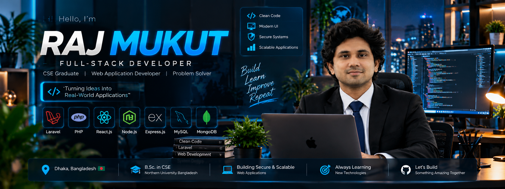
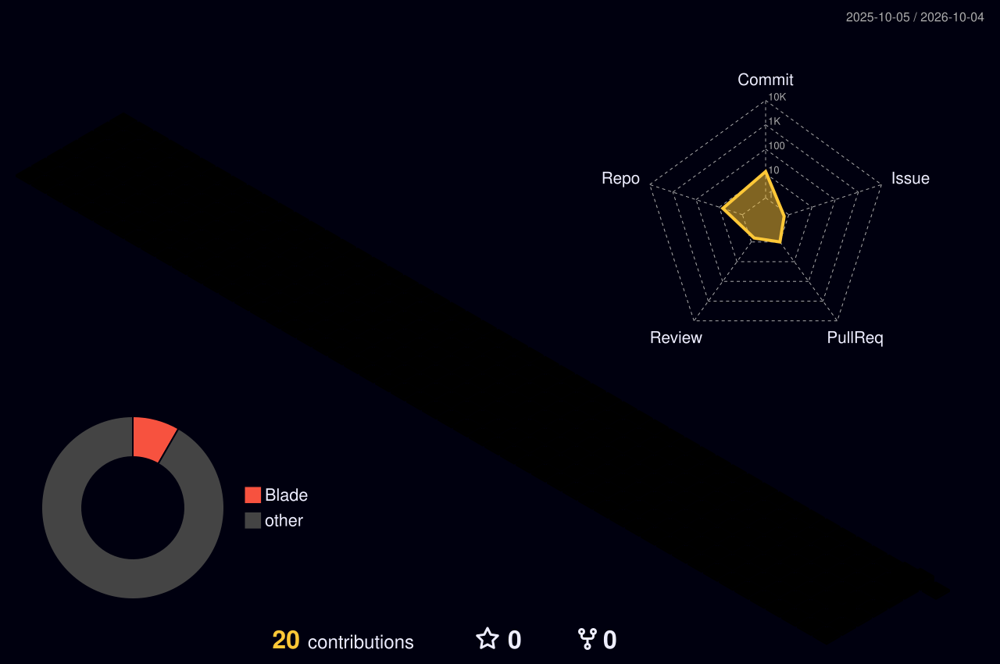

<!--
╔════════════════════════════════════════════════════════════════════╗
║                                                                    ║
║                 R A J   M U K U T  //  2026                       ║
║                                                                    ║
║              FULL-STACK DEVELOPER • DIGITAL PROFILE               ║
║                                                                    ║
╚════════════════════════════════════════════════════════════════════╝
-->

<div align="center">

<!-- ========================= HERO ========================= -->



<br/>


<br/>


<br/><br/>


<br/><br/>

<code>DHAKA 🇧🇩</code>
&nbsp; • &nbsp;
<code>FULL-STACK</code>
&nbsp; • &nbsp;
<code>WEB SYSTEMS</code>
&nbsp; • &nbsp;
<code>PROBLEM SOLVER</code>

</div>

<br/>

<!-- ========================= IDENTITY ========================= -->

<div align="center">

## `◢ DEVELOPER_IDENTITY ◣`

```text
┌─────────────────────────────────────────────────────────────────┐
│                                                                 │
│                      R A J   M U K U T                          │
│                                                                 │
│                FULL-STACK WEB DEVELOPER                         │
│                                                                 │
│              BUILD  •  LEARN  •  IMPROVE                       │
│                                                                 │
└─────────────────────────────────────────────────────────────────┘
```

</div>

<table>
<tr>

<td width="58%" valign="top">

### `01 // PROFILE`

I'm **Raj Mukut**, a **Full-Stack Developer** and **CSE Graduate** focused on building modern, secure and practical web applications.

I enjoy turning real-world ideas into complete software systems — from interface and backend logic to databases and access control.

<br/>

**🎓 Education**

B.Sc. in Computer Science & Engineering  
**Northern University Bangladesh**

<br/>

**📍 Based in**

Dhaka, Bangladesh 🇧🇩

</td>

<td width="42%" valign="top">

### `02 // SYSTEM.config`

```yaml
USER:
  Raj Mukut

ROLE:
  Full-Stack Developer

FOCUS:
  Web Applications
  Backend Systems
  Secure Architecture

CORE:
  Laravel
  React.js
  Node.js

DATA:
  MySQL
  MongoDB

STATUS:
  ● BUILDING
```

</td>

</tr>
</table>

<br/>

<!-- ========================= TECHNOLOGY ========================= -->

<div align="center">

## `⚡ TECHNOLOGY_MATRIX`

### `TOOLS I USE TO TURN IDEAS INTO SOFTWARE`

<br/>


<br/><br/>

<table>
<tr>

<td align="center" width="25%">

### `FRONTEND`

React.js  
JavaScript  
Tailwind CSS

</td>

<td align="center" width="25%">

### `BACKEND`

Laravel  
PHP  
Node.js

</td>

<td align="center" width="25%">

### `DATABASE`

MySQL  
MongoDB

</td>

<td align="center" width="25%">

### `ENGINEERING`

Authentication  
Security  
Architecture

</td>

</tr>
</table>

<br/>

```text
             FRONTEND
                 │
                 ▼
        ┌─────────────────┐
        │   APPLICATION   │
        └────────┬────────┘
                 │
        ┌────────┴────────┐
        ▼                 ▼
     BACKEND           SECURITY
        │                 │
        └────────┬────────┘
                 ▼
             DATABASE
                 │
                 ▼
              PRODUCT
```

</div>

<br/>

<!-- ========================= PROJECTS ========================= -->

<div align="center">

## `🚀 PROJECT_UNIVERSE`

### `SELECTED SYSTEMS // REAL-WORLD BUILDS`


</div>

<table>
<tr>

<td width="50%" valign="top">

### `01` 🎓 UNIVERSITY CONNECT

**University Community Ecosystem**

Role-based platform connecting students, alumni, mentors and administrators.

**CORE**

`Newsfeed` • `Mentorship` • `Jobs`  
`Messaging` • `Events` • `Profiles`

**STACK**

`Laravel` `PHP` `MySQL` `Tailwind`

<br/>

> `STUDENT → ALUMNI → MENTOR → ADMIN`

</td>

<td width="50%" valign="top">

### `02` 🛡️ NIRBHOY BANGLADESH

**Public Reporting Platform**

Public reporting system with evidence management, tracking and administrative verification.

**CORE**

`Reports` • `Evidence` • `Tracking`  
`Locations` • `Verification` • `Hot List`

**STACK**

`Laravel` `Livewire` `MySQL` `Tailwind`

<br/>

> `REPORT → VERIFY → PUBLISH`

</td>

</tr>

<tr>

<td width="50%" valign="top">

### `03` 🏥 MEDHBOOK

**Healthcare Management System**

Healthcare platform connecting patients, doctors and administrators with secure medical record access.

**CORE**

`Doctors` • `Appointments`  
`Medical Records` • `Secure Access`

**STACK**

`React.js` `Node.js` `Express.js` `MongoDB`

<br/>

> `PATIENT → DOCTOR → CARE`

</td>

<td width="50%" valign="top">

### `04` 💻 MORE BUILDS

**Developer Portfolio**

`Laravel` • `PHP` • `MySQL`

Modern developer portfolio with project showcase and administration.

<br/>

**🧠 Disease Prediction System**

`Python` • `Machine Learning`

Structured symptom-to-prediction workflow.

<br/>

> `IDEA → ARCHITECTURE → PRODUCT`

</td>

</tr>
</table>

<br/>

<!-- ========================= TELEMETRY ========================= -->

<div align="center">

## `◉ LIVE_DEVELOPER_TELEMETRY`

### `GITHUB // RAJMUKUT791`

<br/>


<br/><br/>


<br/><br/>


</div>

<br/>

<!-- ========================= 3D CONTRIBUTION ========================= -->

<div align="center">

## `🌌 3D_CONTRIBUTION_MATRIX`

### `365 DAYS // ONE DEVELOPMENT JOURNEY`

<br/>



<br/>

```text
        ◉ BUILD
            │
            ▼
        ◉ LEARN
            │
            ▼
        ◉ IMPROVE
            │
            ▼
        ◉ REPEAT
```

### `CONSISTENCY > INTENSITY`

</div>

<br/>

<!-- ========================= FOCUS ========================= -->

<div align="center">

## `🎯 CURRENT_FOCUS`

<table>
<tr>

<td width="33%" align="center">

### ⚙️ `BUILD`

Full-Stack  
Applications

</td>

<td width="33%" align="center">

### 🧠 `MASTER`

Backend  
Architecture

</td>

<td width="33%" align="center">

### 🔐 `IMPROVE`

Security &  
System Design

</td>

</tr>
</table>

</div>

<br/>

<!-- ========================= TERMINAL ========================= -->

<div align="center">

## `>_ DEVELOPER_TERMINAL`

```bash
┌──(raj㉿github)-[~/profile]
│
├─$ whoami
│  Raj Mukut // Full-Stack Developer
│
├─$ mission
│  Build useful software for real-world problems.
│
├─$ stack
│  Laravel • React.js • Node.js • MySQL • MongoDB
│
├─$ mindset
│  Build → Learn → Improve → Repeat
│
└─$ status
   ● READY TO BUILD _
```

</div>

<br/>

<!-- ========================= CONNECT ========================= -->

<div align="center">

## `◈ CONNECTION_PORT`

### `LET'S TURN IDEAS INTO SOFTWARE.`

<br/>


<br/>
### `CODE`　→　`BUILD`　→　`LEARN`　→　`EVOLVE`

<br/>


</div>

<!--
════════════════════════════════════════════════════════════════════
                     END // RAJ MUKUT
════════════════════════════════════════════════════════════════════
-->
